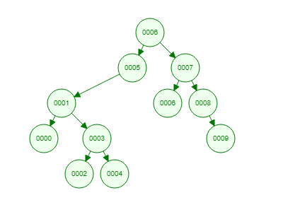

# Patika.dev
## Veri Yapıları ve Algoritmalar Dersi
### Proje 3

[7, 5, 1, 8, 3, 6, 0, 9, 4, 2] dizisinin Binary-Search-Tree aşamalarını yazınız.

**Çözüm**

root olarak 6 kabul edilirse
ve yukarıdaki liste sırasıyla gönderilirse aşağıdaki ağaç yapısı oluşur

Kontrol için: *https://www.cs.usfca.edu/~galles/visualization/BST.html*